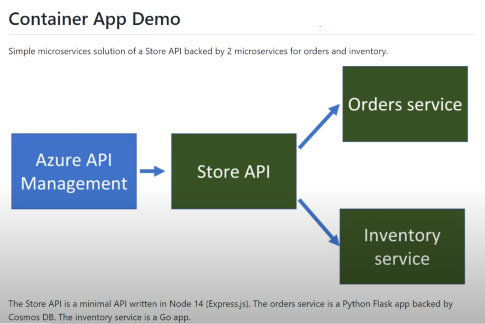

# 概要

Ignite 2021 で、[Azure Container Apps](https://azure.microsoft.com/ja-jp/services/container-apps/) が発表された。どんなものなのかはさておき、コンテナホスティング難民のオアシスになりそうに感じなのでまずは使ってみる。

まずは、サンプルを[Container App Store Microservice Sample](https://github.com/Azure-Samples/container-apps-store-api-microservice)を動かしてみよう。

このサンプルは、Azure Container Apps 上で store serivce が、order service と inventory service を呼ぶ。Dapr で、サービス間の通信と呼び出しを保護し、Azure API Management と Azure Cosmos DBを使っており、CI/CD用の GitHub Actions と Bicep で構成されている。

概要は、[Azure Container Apps Demo - Serverless Microservices](https://www.youtube.com/watch?v=fmGHEJL81rU)の動画を見ると分かる。

1. レポジトリをforkする
2. GitHub Actionようにクレデンシャルを設定する

https://github.com/microsoft/azure-container-apps

---

[^1]: 一部の機能は、実装しないことがを選択しているものもある、[ユーザー定義関数 Issue 2](https://github.com/Azure/bicep/issues/2)、外部テンプレート、outer scopeなど。
[^2]: dev-containersの元ネタは、 [ここ](https://github.com/microsoft/vscode-dev-containers/tree/v0.166.1/containers/azure-bicep) 。欲しいものが全部入っているわけではないので、ここに適時必要なものをいれる。自分用にカスタマイズした、dev container を[ここ](https://github.com/takekazuomi/devcontainer-bicep)にあげてある。
[^3]: snippets は[絶賛実装中](https://github.com/Azure/bicep/issues?q=+label%3A%22story%3A+snippets%22)で現時点(0.3.539)で大分良くなった。
[^4]: ARM Template だと、これに`functions` が入るが、bicepでは未実装。
[^5]: そもそも、タイプ情報がたりなかったり、bicepでうまく扱えないパターンがあったりで、まだ足りない部分もある。おかしいなと思ったら、[Missing type validation / inaccuracies #784](https://github.com/Azure/bicep/issues/784) を見ると参考になる。
[^6]: [bicep のFAQ](https://github.com/Azure/bicep#faq)の `Is this ready for production use?` に、`Yes. As of v0.3, Bicep is now supported by Microsoft Support Plans` とある。まだプレビューではあるが、プロダクションに利用できて、 Microsoft Support Plans でサポートされるとある。

